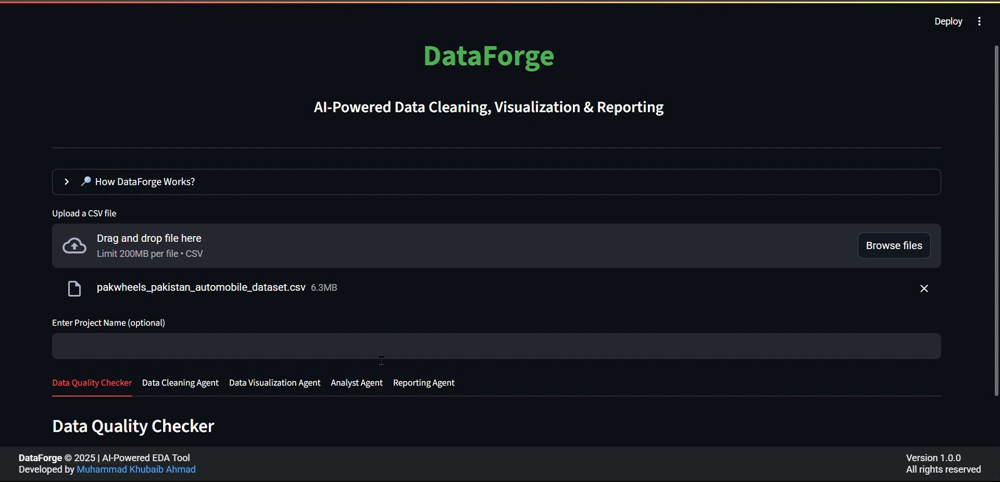

# DataForge: AI-Powered EDA & BI Assistant

**DataForge** is an AI-powered multi-agent system that streamlines
exploratory data analysis (EDA), cleaning, visualization, querying, and
reporting --- all from a single interface.\
It combines automation with flexibility, enabling both technical and
non-technical users to explore, clean, analyze, and report on datasets
efficiently.

------------------------------------------------------------------------

**Interface**


## Features

### 🔍 Data Quality Checker
    
-   Automatically detects missing values, duplicates, and invalid
    entries.
-   Generates a summary of dataset health.

### 🧹 Cleaning Agent
   
-   Suggests and applies AI-driven cleaning operations.
-   Maintains a cleaned version of the dataset for further analysis.

### 📊 Visualization Agent

-   Generates **static and interactive visualizations**.
-   Allows export of plots as **HTML** or inclusion in PDF reports.
-   Offers professional, structured explanations for each plot (What it
    shows, Key Insights, How to use).

### 🤖 Analyst Agent (AI Querying)

-   Supports **natural language queries** (e.g., *"Show me a bar chart
    of sales by region"*).
-   Automatically translates NL queries into SQL and executes them.
-   Also supports **manual SQL queries** for advanced users.
-   Enables **interactive data exploration** without needing SQL
    knowledge.

### 📝 Reporting Agent

-   Creates a **professional PDF report** including:
    -   Data quality summary
    -   Cleaning operations performed
    -   Dataset info
    -   Visualizations with structured insights
-   Auto-generated sections: **What this plot shows, Key insights, How
    to use this**.

------------------------------------------------------------------------

## 📂 Project Structure

    DataForge/
    │── app.py               # Main Streamlit application
    │── eda_utils.py         # Utilities for EDA & data summaries
    │── sql_conn.py          # SQL connection & query execution
    │── styling.py           # CSS & custom theming
    │── llm.py               # LLM-based agents & calls
    │── pdf_func.py          # PDF generation functions (title page, reports)
    │── README.md            # Project documentation

------------------------------------------------------------------------

## 💡 Why DataForge?

Unlike standard EDA libraries, DataForge: - **Understands natural
language** for data exploration.
- **Cleans data automatically** with AI-powered agents.
- **Generates professional reports** ready for business use.
- **Provides both interactive BI-style queries and automated analysis.**

It's not just an EDA helper --- it's a **mini AI-powered BI + EDA
assistant**.

------------------------------------------------------------------------

## 📦 Installation

1.  Clone the repository:

``` bash
git clone https://github.com/Khubaib8281/dataforge.git
cd dataforge
```

2.  Install dependencies:

``` bash
pip install -r requirements.txt
```

3.  Run the app:   

``` bash   
streamlit run app.py    
```

------------------------------------------------------------------------

## 📜 License

This project is licensed under the MIT License.

------------------------------------------------------------------------

## 👨‍💻 Author

Developed by [Muhammad Khubaib
Ahmad](https://www.linkedin.com/in/muhammad-khubaib-ahmad-)\
**AI/ML Engineer & Data Scientist**
